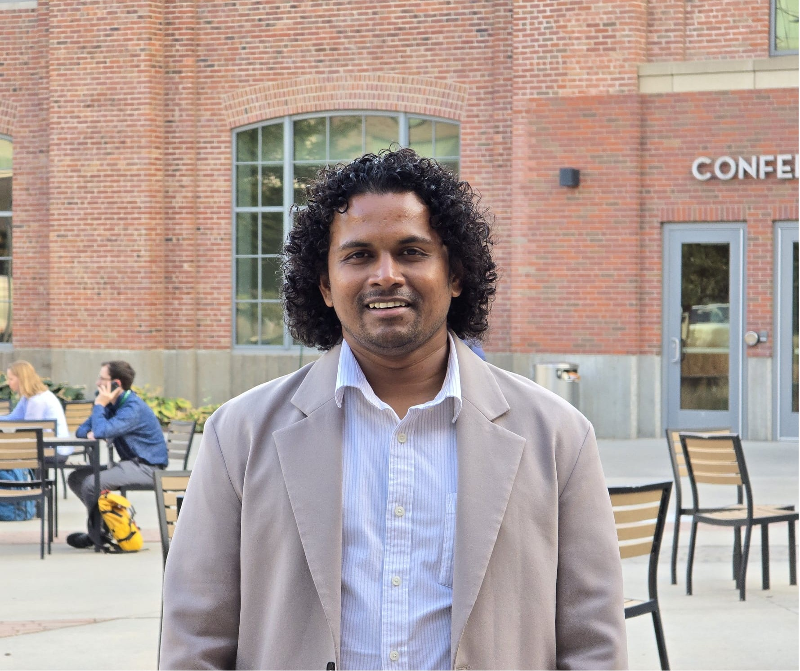

# Uday Santhosh Raju Vysyaraju  

[College Station, Texas] | [+1 979-422-4723] | [uday@tamu.edu]  
  \\
  \\
  \\
  \\
  \\
  \\
  \\

---
  
## **Summary**  
Computer Vision and Machine Learning Engineer with a proven track record of building end-to-end AI solutions in **object detection, tracking, segmentation, and behavior recognition**. Passionate about leveraging advanced machine learning techniques to solve **real-world challenges** in industries ranging from **agriculture** to **healthcare**. Experienced in delivering high-impact results through innovative model design, data pipelines, and scalable systems.

---

## **Skills**

**Programming Languages:** Python, C++, MATLAB  
**Frameworks & Tools:** PyTorch, TensorFlow, OpenCV, Ultralytics, Autodistill, PlantCV  
**Techniques:** Object Detection (YOLO), Segmentation, Tracking, Self-Supervised Learning, CLIP, Transformers, CNNs, LSTMs  
**Data Tools:** Pandas, NumPy, Scikit-Learn, SQL  
**Other Skills:** Data Collection & Labeling, Algorithm Design, GUI Development, Hardware Integration  

---

## **Education**

**Master of Science in Data Science**  
*Texas A&M University*, College Station, TX | **May 2025**  
CGPA: **4.0/4.0** | Focus: Computer Science & Engineering  

**Bachelor & Master of Technology in Electronics & Electrical Communication Engineering**  
*Indian Institute of Technology Kharagpur*, India | **Jul 2018**  
CGPA: **8.57/10**  

---

## **Research Experience**

### **Graduate Assistant Research**  
*Texas A&M Institute of Data Science* | **Jun 2024 – May 2025**  
- Designed a **computer vision pipeline** for **early detection of Bovine Respiratory Disease** (BRD) in beef cattle.  
- Developed a **CLIP-based activity recognition** system for cow movement analysis.  
- Integrated detection and segmentation models to track cow activity and monitor behavior.  

### **Graduate Researcher**  
*Advanced Vision and Learning Lab, Texas A&M* | **Jan 2024 – Aug 2024**  
- Built a **large-scale automated plant phenotyping pipeline** for agricultural analysis.  
- Designed modules for **data preprocessing, plant feature extraction**, and **visual analysis**.  
- Developed a user-friendly **GUI** for streamlined plant phenotype exploration.  

---

## **Industry Experience**

### **AI Specialist Researcher**  
*LG Electronics*, Seoul, South Korea | **Sep 2018 – Sep 2022**  
- **X-ray Detection**: Improved detection accuracy by **7%** using **GAN-based synthetic datasets**.  
- **Smart CCTV System**: Deployed real-time **object tracking** for crowd monitoring and loitering detection.  
- **Analog Meter Reading**: Achieved **85% accuracy** using **CNN-based custom models** and robust augmentation.  
- **Smart Retail Automation**: Enhanced product recognition using **few-shot learning** and image processing techniques.

### **Digital VLSI Intern**  
*Texas Instruments*, Bengaluru, India | **May 2017 – Jul 2017**  
- Integrated **Cadence Elastic Compression architecture** on System-on-Chip.

### **R&D Intern**  
*Jana Care*, Bengaluru, India | **May 2016 – Jul 2016**  
- Designed and prototyped a **docking system** for a mobile blood analyzer.

---

## **Hackathons & Competitions**  

🏆 **2nd Place** – *American Airlines Hackathon* | **Feb 2024**  
Built a **destination recommender** system using collaborative filtering techniques.

🏆 **2nd Place** – *AgriTech Challenge, TAMU Datathon* | **Nov 2024**  
Developed a **CNN-based cotton field detector** using satellite imagery and weather data.

🏆 **4th Place** – *MLCAS Corn Yield Prediction Challenge* | **Oct 2024**  
Designed a **multi-modal CNN** combining satellite images and numerical data to predict corn yield.

---

## **Workshops & Presentations**

- **Plant Phenotyping Workshop** – *AI in Agriculture 2024* | [**Colab Notebook**](https://colab.research.google.com/drive/1nbNQPilXnFsftwtq1V7HHdjqUguVKGK4?usp=sharing)  
- **Poster Presentation** – *Texas A&M Beef Sustainability Summit* | [**View Poster**](media/datathon_poster.pdf)  

---

## **Certifications & Awards**

🏅 **American Airlines Hackathon** – **2nd Place**  
🏅 **TAMU Datathon AgriTech Challenge** – **2nd Place**  
🏅 **MLCAS Corn Yield Prediction** – **4th Place**  

---

## **Get in Touch**  

If you'd like to collaborate, discuss my projects, or connect professionally, feel free to [email me](mailto:uday@tamu.edu) or reach out through [LinkedIn](https://www.linkedin.com/in/uday-santhosh-raju-v/).

---

